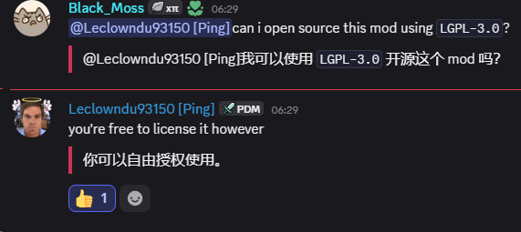

[English Guide](README.md)

# Thaumaturge Tweaks

面向 **[Thaumaturge](https://github.com/Leclowndu93150/Thaumaturge)** 的便利性扩展模组，基于 **NeoForge 26.1.2**（Minecraft 26.1.2）构建。

为本体模组补充了 REI 配方/信息支持、参考 ThaumicInventoryScanning 的物品栏扫描功能，以及魔导手册、研究台与神秘炼金塔界面的操作增强。

## 功能特性

### REI 集成（需要 REI）
为 [Roughly Enough Items](https://www.curseforge.com/minecraft/mc-mods/roughly-enough-items) 添加了Thaumaturge全部内容支持：

- **奥术工作台**配方
- **坩埚**配方
- **注魔**配方，含注魔附魔与符文强化变体
- **世界盐触发**配方
- **多方块**结构
- **要素合成**——每个要素由哪些子要素组合而来
- **要素来源物**——某要素出现在哪些物品上
- 专用的**要素（Aspect）条目类型**，并为每个已注册要素提供信息页

### 物品栏扫描
灵感来源并参考了 [神秘时代物品栏扫描 Thaumcraft Inventory Scanning](https://www.curseforge.com/minecraft/mc-mods/thaumcraft-inventory-scanning)（作者 BlayTheNinth）：

- 将**魔导透镜**拿在鼠标指针上（从物品栏中拿起），悬停在任意打开容器内的物品或自己的玩家模型上即可扫描。
- 悬停时播放短暂的扫描动画，完成后该物品/实体被记入你的扫描知识，并揭示其要素构成。
- 已扫描过的目标会直接显示要素标签。
- 需要客户端与服务端同时安装本模组。

### 魔导手册操作增强
为魔导手册的研究/条目详情界面提供便利操作：

- **鼠标滚轮**上下——上一页/下一页
- **左右方向键**——上一页/下一页
- **退格键**——关闭界面
- **鼠标右键**——关闭界面（处于子视图时先返回主视图）

### 研究台操作增强
为研究台界面提供便利操作：

- **要素调色板**可通过**鼠标滚轮**（悬停在调色板区域）或 **PageUp / PageDown / 方向键**翻页。
- **拖拽合成**——将一个要素拖到另一个要素上释放即可立即合成；按住 **Shift** 可批量合成最多 10 次（材料不足时按实际可用量尽量合成）。
- **要素合成参考（帮助面板）**可通过鼠标滚轮翻页，并可用**退格键**或**鼠标右键**关闭。
- **鼠标右键**点击研究六边形网格上已放置的要素可将其擦除（与左键擦除一致）。

### 神秘炼金塔操作增强
为神秘炼金塔（自动炼金）界面提供便利操作：

- **鼠标滚轮**（悬停在配方网格区域）——上一页/下一页（与点击上下箭头等效）
- **PageUp / PageDown** 或**上下方向键**——上一页/下一页

### 按住 Shift 显示要素图标（要素安瓿 & 水晶碎片）
按住 **Shift** 可直接查看部分含要素物品的**要素图标**（参考 [神秘时代要素注释 Thaumcraft Aspect Annotations](https://github.com/Aedial/Thaumcraft-Aspect-Annotations)，渲染风格亦借鉴了 Avaritia 奇点物品的材料预览）：

- 按住 **Shift** 时，**要素安瓿**与**要素水晶碎片**会以所含的**要素图标**（含要素颜色）渲染，取代其默认的安瓿/碎片贴图——在背包界面、手持状态、掉落物以及 REI 配方界面中均生效。
- 松开 **Shift** 即恢复默认贴图。
- 仅对这两种物品生效，其它物品渲染保持不变。

## 致谢

- **[Thaumaturge](https://github.com/Leclowndu93150/Thaumaturge)**，作者 Leclowndu93150——本模组扩展的父模组。
- **[神秘时代物品栏扫描 Thaumcraft Inventory Scanning](https://www.curseforge.com/minecraft/mc-mods/thaumcraft-inventory-scanning)**，作者 BlayTheNinth——物品栏扫描功能的灵感来源与参考对象。
- **[神秘时代要素注释 Thaumcraft Aspect Annotations](https://www.curseforge.com/minecraft/mc-mods/thaumcraft-aspect-annotations)**，作者 Aedial——要素图标显示功能的灵感来源与参考对象。

## 授权

本模组获得作者授权并开源。

## 许可证

[LGPL-3.0](LICENSE.md)
